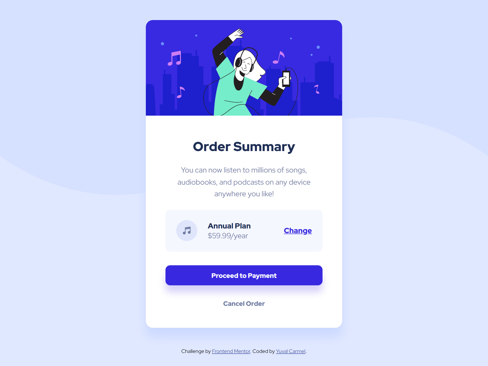
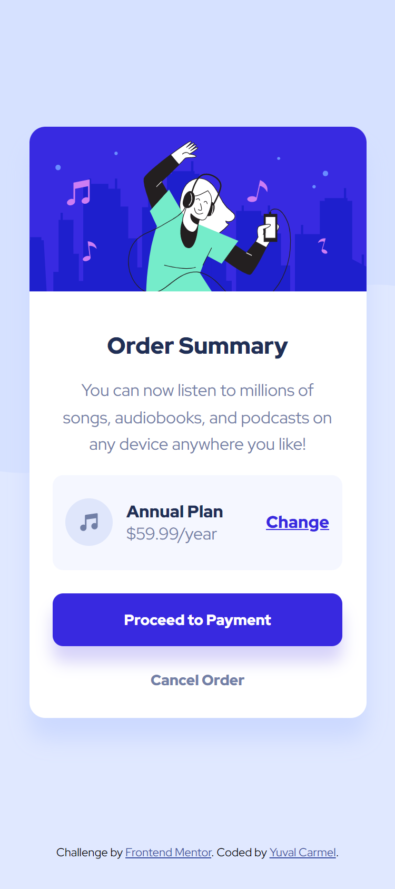

# Frontend Mentor - Order summary card solution

This is a solution to the [Order summary card challenge on Frontend Mentor](https://www.frontendmentor.io/challenges/order-summary-component-QlPmajDUj). Frontend Mentor challenges help you improve your coding skills by building realistic projects. 

## Table of contents

- [Overview](#overview)
  - [The challenge](#the-challenge)
  - [Screenshot](#screenshot)
  - [Links](#links)
- [My process](#my-process)
  - [Built with](#built-with)
  - [What I learned](#what-i-learned)
  - [Continued development](#continued-development)
  - [Useful resources](#useful-resources)
- [Author](#author)

## Overview

### The challenge

Users should be able to:

- See hover states for interactive elements

### Screenshot




### Links

- Solution URL: [Solution URL](https://github.com/hoomi88/order-summary-component-main)
- Live Site URL: [Live URL](https://hoomi88.github.io/order-summary-component-main/)

## My process

### Built with

- Semantic HTML5 markup
- CSS custom properties

### What I learned

In order to have the image at the top with the correct border radius:

To see how you can add code snippets, see below:

```html
 <div>
    
  </div>
```

And create the band radius only on the two top corners:

```css
.card-image {
  border-radius: 15px 15px 0 0;
  width: 100%;
}
```

### Continued development

I was strugle with the product payment box. Not easy to align the items. Need to have a table like structure there with a predefined fractional width to every item.


### Useful resources

- [Best school for HTML and CSS](https://www.w3schools.com/) - A lot of explenation, instructions and examples.
- [MDN Web Docs](https://developer.mozilla.org/) - The complete database for everything about web design.

**Note: Delete this note and replace the list above with resources that helped you during the challenge. These could come in handy for anyone viewing your solution or for yourself when you look back on this project in the future.**

## Author

- Frontend Mentor - [@hoomi88](https://www.frontendmentor.io/profile/hoomi88)


